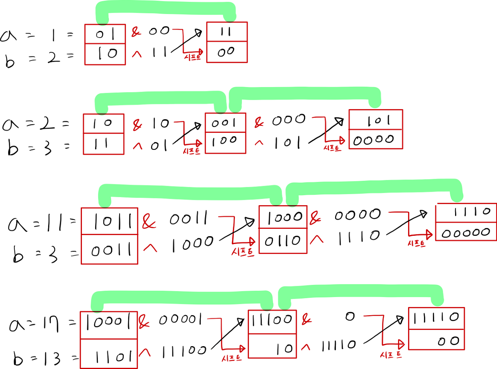

# Binary 문제 정보

## 371. Sum of Two Integers

Given two integers a and b, return the sum of the two integers without using the operators + and -.

Example 1:

```
Input: a = 1, b = 2
Output: 3
```

Example 2:
```
Input: a = 2, b = 3
Output: 5
```

Constraints:

`-1000 <= a, b <= 1000`

### 해답

2와 3을 2진수 덧셈 연산으로 계산해볼게요

10과 11을 더하면 101이 된다는 것을 사람은 알고 있죠.

그럼 계산 수식을 어떻게 알고리즘으로 풀어야 할까요?

검정색 숫자 "01"은 "10"과 "11"의 XOR 연산 값(같으면 0, 다르면 1)이며

빨간색 숫자 "10"은 "10"과 "11"의 AND 연산 값(모두 1이면 1, 아니면 0)입니다.

따라서 다음과 같이 XOR와 AND 연산이 필요합니다.





## 191. Number of 1 Bits

숫자로 입력되는 값을 2진수 문자열로 변환하고 1 인 문자열의 갯수를 확인

```javascript
/**
 * @param {number} n - a positive integer
 * @return {number}
 */
var hammingWeight = function(n) {
   return n.toString(2).split("").filter(o => o === "1").length
};
```