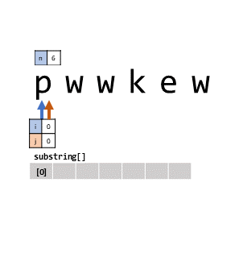

# String

## 3. Longest Substring Without Repeating Characters

### 문제

> Given a string, find the length of the longest substring without repeating characters. 
 - 문자열이 주어진다. 
 - 반복되는 문자가 없는 가장 긴 부분 문자열의 길이를 찾아라.

### 예시

- "abcabcbb" 의 부분 문자열은 "abc" 이며, 그 길이는 3이다.
- "bbbbb" 의 부분 문자열은 "b" 이며, 그 길이는 1이다.
- "pwwkew" 의 부분 문자열은 "wke" 이며, 그 길이는 3이다.
 "pwke” 는 부분문자열이 아니다.


 ### 전략
이 문제는 단순히 가장 긴 부분 문자열을 구하는 문제이기 때문에 간단하게 풀 수 있을것 같지만, 사실 그렇지 않다.
먼저 단순히, 그리디(greedy)하게 문자열의 처음 부터 ㅑ므시작해서 다른 배열에 그 문자를 push(s[i]) 하면서, 이미 push() 한 문자가 나올 경우, 그 반복을 멈추는 방식으로 진행하게 되면 될것 같다고 생각했다.

하지만, 그렇게 하는 경우 예시의 “pwwkew” 와 같은 문자열은 “pw” 만을 나타내게 되어, 최적해가 되지 못한다.

따라서, 이는 동적계획 알고리즘(DP)을 사용해야 한다. 해가 되는 여러 부분문자열들의 집합에서 가장 길이가 긴 문자열을 선택하는 방식을 사용한다.

먼저 기존 문자열(s)의 요소를 포인팅 하는 변수를 i와 j라고 하자. 그리고 Memoization을 위한 배열 substring[]이 있다.


1. i를 0으로 초기화 한다. / n은 s.length이다. / substring[]의 크기를 n으로 하여 선언한다.

2. i<n이면, j에 i를 대입한다. / i==n이면, 과정 4로 간다.

3. j++ 한다.

    1. s[j]가 문자열 substring[i]내에 없거나 j < n 이면, push()한다. 그 후, 과정 3으로 간다.

    2. s[j]가 문자열 substring[i]내에 있으면, i++하고 과정 2로 간다.

4. substring[]내의 최대 크기의 문자열을 찾고 출력한다.




이를 통해 추상화 시키면…
1. i ← 0 / n ← s.length / initialize substring[n]

2. if (i < n) then j ← i / if i==n then, do 4.

3. j++

    1. if there is nos[j] in substring[i] ||j < n, then substring[i] ← push(s[j]). / do 3.

    2. if there is s[j] in substring[i], theni++ / do 2.

4. return MAX (length[] of substring[])

### 구현

```javascript
var lengthOfLongestSubstring = function(s) {
    if(s == "") return 0;
    else {
        /*DP*/
        let i = 0;
        let j = i;
        let n = s.length;
        let substrings = new Array(n);
        while(i < n) {
            substrings[i] = new Array();
            while(substrings[i].indexOf(s[j]) == -1 && j < n) {
                substrings[i].push(s[j]);
                j++;
            }
            i++;
            j = i;
        }
        return MaxLengthAmongElementsOfArray(substrings);
    }
};
var MaxLengthAmongElementsOfArray = (arr) => {
    let length = [];
    let MAX;
    for(let i = 0; i < arr.length; i++) {
        length.push(arr[i].length);
    }
    MAX = length.sort((a,b)=>{return b-a;})[0];
    arr = null; length = null;
    return MAX;
}
```

최댓값을 찾는 함수인 `MaxLengthAmongElementsOfArray()` 를 따로 subroutine 으로 하여 작성하였다.

`substring[i]` 내에 `s[j]` 를 찾는 과정은 `.indexOf()` 메소드를 통해 손쉽게 구할 수 있다. C언어라면 또 함수를 작성해야 했을 것이다…


### [LeetCode] 424. Longest Repeating Character Replacement

- 문제

> 영어 대문자로만 구성된 문자열이 주어지면 해당 문자열에 대해 최대 k 개의 연산을 수행 할 수 있습니다. 한 번의 작업에서 문자열의 문자를 선택하고 다른 대문자 영어 문자로 변경할 수 있습니다. 위의 작업을 수행 한 후 얻을 수 있는 모든 반복 문자를 포함하는 가장 긴 하위 문자열의 길이를 찾습니다.

## 풀이

슬라이딩 윈도우를 늘려가는 동시에 조건에 따라 줄여가며 검사를 수행한다.

1. 슬라이딩 윈도우는 항상 오른쪽으로 한 칸씩 이동한다.
2. 현재 슬라이딩 윈도우에 들어있는 값들의 수를 계산한다.
3. 슬라이딩 윈도우의 크기 - 가장 큰 비중의 값의 갯수 = 바꿔야하는 갯수이다.
4. 만약, 바꿔야하는 갯수가 k보다 크다면 현재 슬라이딩 윈도우는 불가하므로 왼쪽을 증가시켜 슬라이딩 윈도우의 크기를 줄인다.
5. k가 크거나 같다면 현재 윈도우와 최대 윈도우의 크기를 비교해 최대 윈도우를 갱신시킨다.
